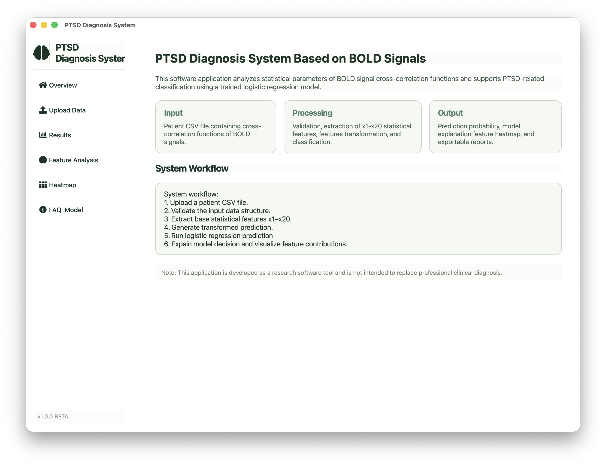
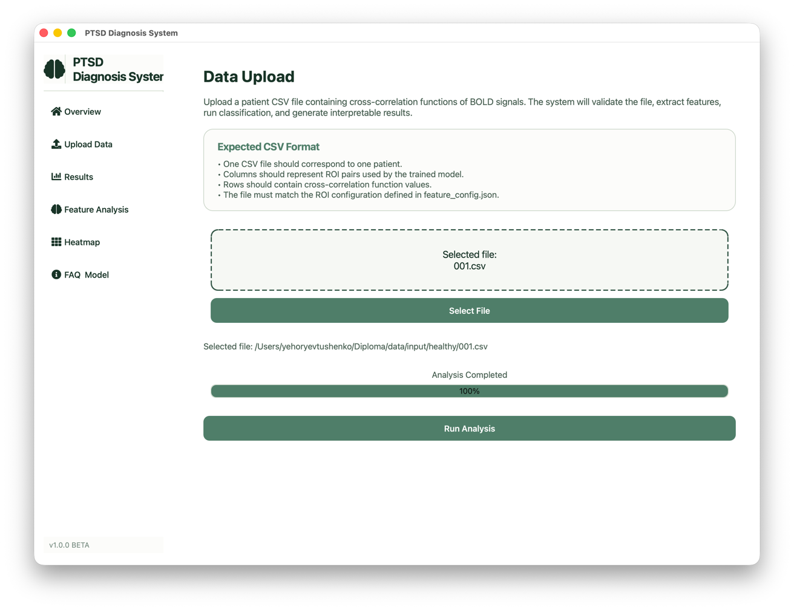
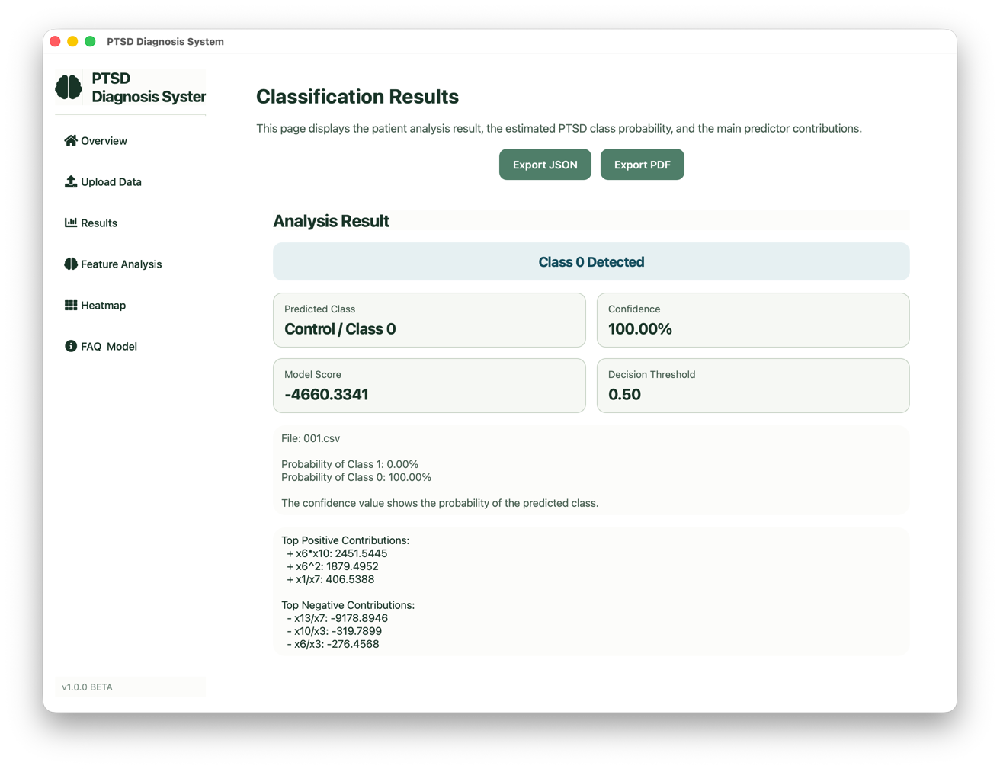
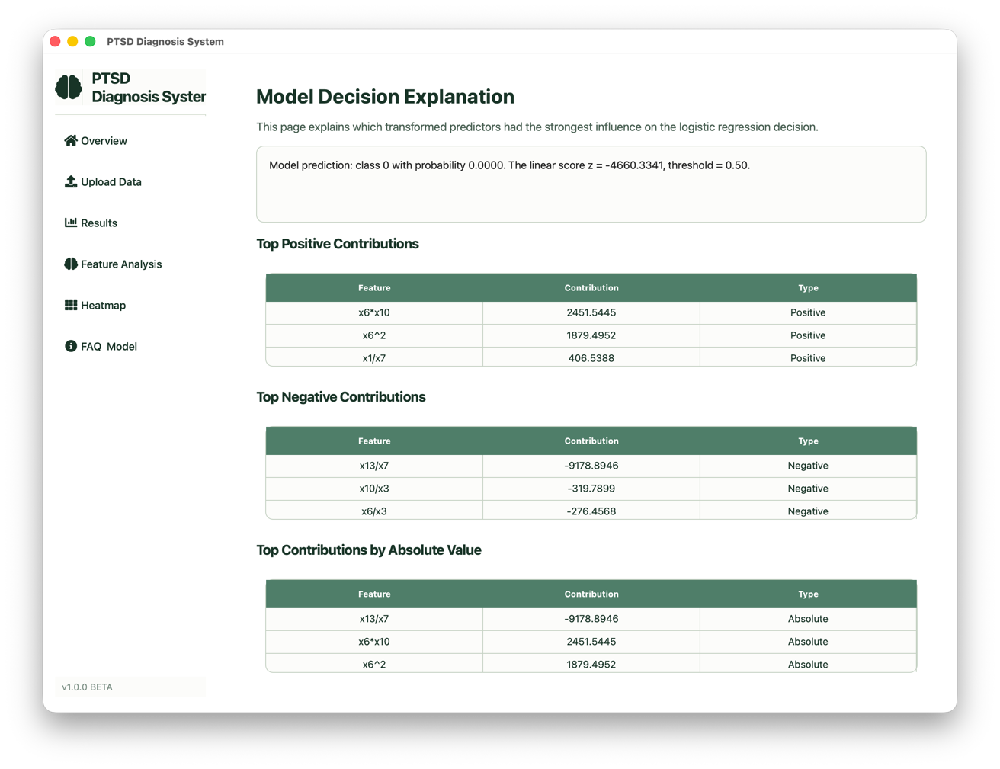
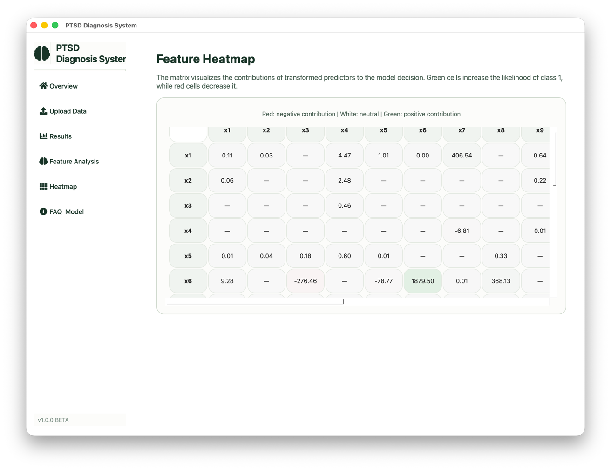
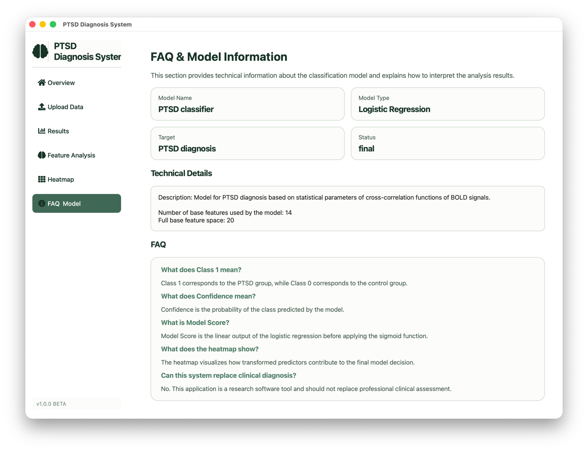

# PTSD Diagnosis System Based on BOLD Signals

Desktop software application for PTSD classification based on statistical parameters of BOLD signal cross-correlation functions.

The system performs:
- CSV validation
- feature extraction
- feature transformation
- logistic regression classification
- model explanation
- heatmap visualization
- PDF and JSON report generation
---
# Project Overview

This application was developed as part of a diploma research project focused on investigating the effectiveness of statistical characteristics of BOLD signal cross-correlation functions for PTSD diagnosis.

The system analyzes transformed predictors derived from statistical features x1–x20 and estimates the probability of PTSD class membership using a trained logistic regression model.

The application also provides explainable AI functionality:
- predictor contribution analysis
- positive and negative feature impact visualization
- feature heatmaps
- model metadata inspection
---

# Main Features

## Data Upload
- drag-and-drop CSV support
- CSV validation
- progress tracking

## Feature Extraction
- extraction of statistical characteristics
- transformed predictor generation
- engineered feature support

## Classification
- logistic regression prediction
- probability estimation
- confidence calculation

## Explainability
- top positive contributions
- top negative contributions
- absolute contribution ranking
- model score interpretation

## Heatmap Visualization
- transformed feature matrix
- contribution intensity visualization
- positive/negative predictor mapping

## Export
- JSON report export
- PDF report export
---

# Technologies Used

## Backend
- Python
- pandas
- numpy
## UI
- PySide6
- QtAwesome

## Reporting
- ReportLab

## Testing
- pytest
---

# Project Structure

```text
Diploma/
│
├── backend/
│   ├── controllers/
│   ├── domain/
│   └── services/
│
├── config/
│
├── data/
│
├── models/
│
├── tests/
│
├── ui/
│   ├── pages/
│   ├── styles/
│   ├── widgets/
│   └── workers/
│
├── utils/
│
├── README.md
├── app.py
├── main.py
└── requirements.txt
```
---

# Application Workflow

1. Upload patient CSV file
2. Validate input data
3. Extract statistical features
4. Generate transformed predictors
5. Run logistic regression model
6. Calculate probabilities
7. Generate explanation
8. Visualize feature contributions
9. Build heatmap
10. Export JSON/PDF reports
---

# Prediction Interpretation

## Class Labels
- **Class 0** — Control group
- **Class 1** — PTSD group

## Confidence
Confidence represents the probability of the predicted class.

## Model Score
Model Score (z-score) is the linear output of logistic regression before sigmoid transformation.

## Heatmap Interpretation
- Green cells increase the likelihood of PTSD class prediction.
- Red cells decrease the likelihood of PTSD class prediction.
- White cells indicate weak or neutral contribution.
---

# Installation

## Clone repository

```bash
git clone <repository_url>
cd Diploma
```

## Create virtual environment

```bash
python -m venv .venv
```

## Activate environment

### macOS/Linux

```bash
source .venv/bin/activate
```

### Windows

```bash
.venv\Scripts\activate
```

## Install dependencies

```bash
pip install -r requirements.txt
```
---

# Run Application

```bash
python main.py
```
---

# Required Input Format

The application expects:

- one CSV file per patient
- ROI pair columns
- cross-correlation function values
- consistent structure with `feature_config.json`

Each uploaded CSV file should correspond to a single patient and contain the required ROI pair configuration used during model training.
---

# Testing

Run all tests:

```bash
python -m pytest
```

Run a specific test file:

```bash
python -m pytest tests/test_prediction.py
```

Current test coverage includes:
- prediction service
- validation service
- statistical feature computation
---

# Screenshots

## Overview Page


## Upload Page


## Results Page


## Explanation Page


## Heatmap Page


## FAQ & Model Information


---

# Disclaimer

This software is a research-oriented application developed for academic purposes and should not replace professional clinical diagnosis.

The system was created to investigate the effectiveness of statistical characteristics of BOLD signal cross-correlation functions for PTSD classification.

---

# Author

Developed as part of a diploma project focused on PTSD diagnosis using BOLD signal analysis.
